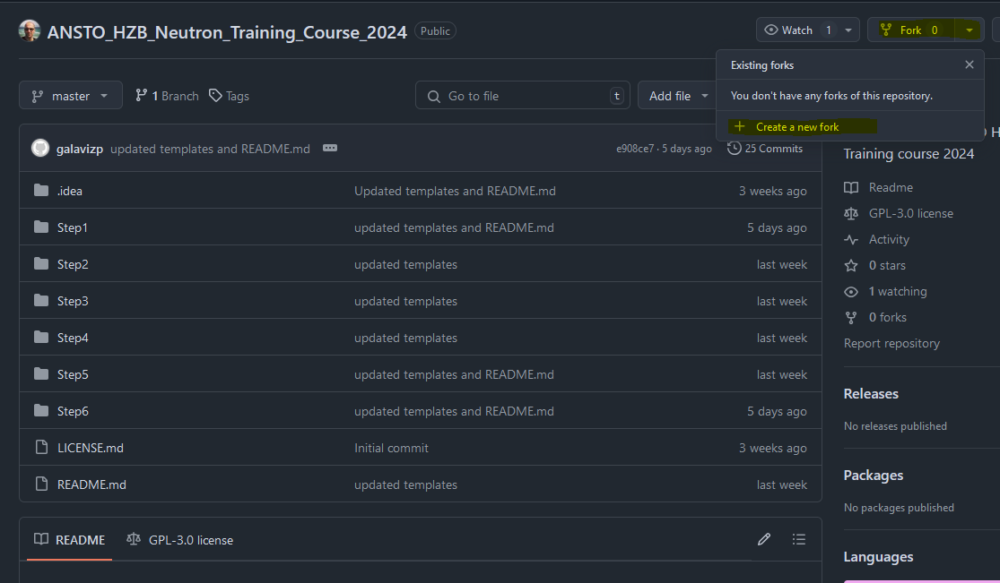

# ANSTO - HZB Neutron Training Course 2024 

The Australian Nuclear Science and Technology Organisation (ANSTO) and the Helmholtz Zentrum Berlin (HZB) Neutron Training Course 2024 aims to provide a broad overview of neutron scattering theory and applications to demonstrate the utility of the technique to a wide range of sciences. 

This repository contains the necessary files for the practical session in computational analysis (an introduction to DFT calculation with Quantum Espresso).

Each directory contains a README.md file with instructions and details about the stored files and scripts. 

## Getting Started

git clone repository 
```shell
git clone git@github.com:pablogalaviz/ANSTO_HZB_Neutron_Training_Course_2024 
cd ANSTO_HZB_Neutron_Training_Course_2024
```

### Prerequisites

To run the practicals during the training course, you need access to [Setonix](https://pawsey.org.au/systems/setonix/) (We will provide the login details during the course).

To run the practicals on your own HPC or server, you need to install Quantum Espresso. Follow the [installation instructions](https://www.quantum-espresso.org/Doc/user_guide/node7.html). 

### Forking the GitHub repository

Log in or sign in to GitHub. Open the repository's [page](https://github.com/pablogalaviz/ANSTO_HZB_Neutron_Training_Course_2024). Create a fork new fork.




## History

First release October 2024

## Credits

Author: Pablo Galaviz

Contact: https://www.ansto.gov.au/scientific-computing


**Nuclear science and technology for the benefit of all Australians**  

## License

ANSTO_HZB_Neutron_Training_Course_2024 is free software: you can redistribute it and/or modify
it under the terms of the GNU General Public License as published by
the Free Software Foundation, either version 3 of the License, or
any later version.

ANSTO_HZB_Neutron_Training_Course_2024 is distributed in the hope that it will be useful,
but WITHOUT ANY WARRANTY; without even the implied warranty of
MERCHANTABILITY or FITNESS FOR A PARTICULAR PURPOSE.  See the
GNU General Public License for more details.

You should have received a copy of the GNU General Public License
along with ANSTO_HZB_Neutron_Training_Course_2024.  If not, see <http://www.gnu.org/licenses/>.