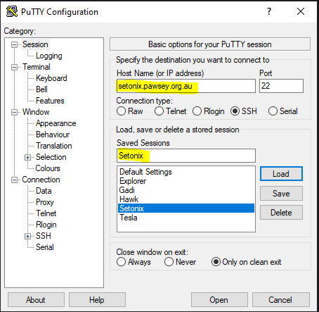
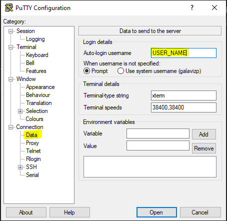
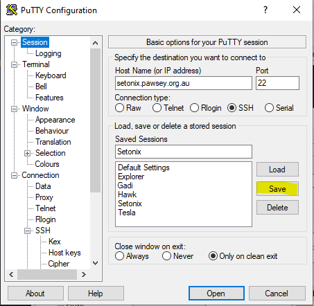
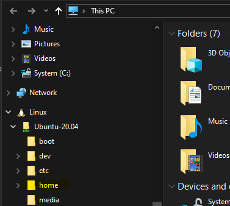

# Prerequisites

## Access to Setonix HPC. 

This section will briefly overview Setonix and configure access to the HPC.
See Setonix's complete [documentation](https://pawsey.atlassian.net/wiki/spaces/US/pages/51930840/Supercomputing+Documentation) for more details. 

If you can access an HPC or server with Quantum Espresso installed, skip Step 2.  

## Login instructions.

**Note: You should complete the following instructions before the start of the practicals!**

We will use Secure Shell (SSH) to connect. First, we need to install an SSH client. 
For Windows computers we can use [PuTTY](https://putty.org/) *(not recommended)* or via [WSL](https://learn.microsoft.com/en-us/windows/wsl/install). 
For macOS and GNU/LINUX, we can use the `ssh` command from the terminal.  

## WSL installation. 
You can install everything you need to run WSL with a single command. 
Open PowerShell or Windows Command Prompt in administrator mode by right-clicking and selecting "Run as administrator", 
enter the wsl --install command, then restart your machine.

```PowerShell
wsl --install
```
You should have an "Ubuntu on Windows" app. The app opens a *bash* terminal.

## Configure ssh with WSL, macOS or GNU/Linux. 

To install the client in Ubuntu-based distributions:
```shell
sudo apt install openssh-client
```
For RedHat based distributions:
```shell
sudo dnf install openssh-clients
```
Or 
```shell
sudo yum install openssh-clients
```
You can connect to Setonix using the command:
```shell
ssh USER_NAME@setonix.pawsey.org.au
```
You need your Pawsey USER_NAME and password. 

### Optional configuration. 

From a terminal create a `config` file under the `~/.ssh` directory:
```shell
cd
mkdir .ssh # ignore the warning if the directory exists
nano .ssh/config
```

Add the following lines to the `config` file with your username. 
```
Host Setonix
     Hostname setonix.pawsey.org.au
     User <PAWSEY_USERNAME>
     Port 22
     ForwardX11 yes
```

Save the file (Ctrl+O) and exit (Ctrl+X). Login to Setonix using the following command:
```shell
ssh Setonix
```

## Configure PuTTY.

Windows users should try to install WSL instead of PuTTY. If you have WSL, skip this section. 
* Add `setonix.pawsey.org.au` to *Sessions --> Host Name*. Add Setonix to *Saved Sessions*. 



* Add your Pawsey username (provided) under *Connection --> Data --> Auto-login username*.



* Return to *Sessions* nd click save. 



* Click Open to start an SSH connection. Use your Pawsey password to log in. 

To copy files between your computer and Setonix, you should install [WinSCP](https://winscp.net/eng/index.php).

# Basic terminal commands 

We will primarily use a command line terminal. Pawsey supercomputers run Linux-based operating systems with a bash terminal. For more details, follow the [shell](https://swcarpentry.github.io/shell-novice/index.html) guide. 

Print the Working Directory using:
```shell
pwd  
```

LiSt the files on the current directory or subdirectory with:
```shell
ls 
ls /path/to/other/directory
```

The Change Directory command is:
```shell
cd /path/to/other/directory
```

# How to copy files

WSL has a special partition on the hard drive. You should copy files to your Linux home directory `Linux->Ubuntu-20.04->home->USER_NAME`



Your files should appear when you list them from the bash terminal. To copy a file from your computer to Setonix use the following command:
```shell
scp pw.in Setonix:scratch/ANSTO_HZB_Neutron_Training_Course_2024/Step2
```
That will copy the input parameter file `pw.in` to the Setonix directory `scratch/ANSTO_HZB_Neutron_Training_Course_2024/Step2`. 

To copy files from Setonix to you laptop you can use a similar command:
```shell
scp -r Setonix:scratch/ANSTO_HZB_Neutron_Training_Course_2024/Step4/result . 
```
This time we use `-r` (recursive) flag to copy the whole directory `scratch/ANSTO_HZB_Neutron_Training_Course_2024/Step4/result` the current directory is denoted by `.`

# Preparing your Setonix workspace

Login to Setonix using ssh. We will run Setonix jobs on a project partition called scratch. We will create a symbolic link (shortcut) to that partition.
```shell
ln -s /scratch/pawseyXXXX/USERNAME scratch 
```
The `ln -s` command makes a symbolic link from the scratch directory to a directory in your home. You should use the correct Pawsey project number and your username.
To check the username, you can use the commands `whoami` or `pwd. ' Change directory to the scratch.
```shell
cd scratch
```
Clone the GitHub project in the scratch partition (if you have a fork, replace with the fork's GitHub address):
```shell
git clone git@github.com:pablogalaviz/ANSTO_HZB_Neutron_Training_Course_2024 
cd ANSTO_HZB_Neutron_Training_Course_2024
```
In the following, we will refer to `ANSTO_HZB_Neutron_Training_Course_2024` directory as your Setonix project directory. 

Add an ssh key following the GitHub [instructions](https://docs.github.com/en/authentication/connecting-to-github-with-ssh/generating-a-new-ssh-key-and-adding-it-to-the-ssh-agent).

# Additional tools 

Install [PyCharm Community Edition](https://www.jetbrains.com/edu-products/download/download-thanks-pce.html) to manage your project.

