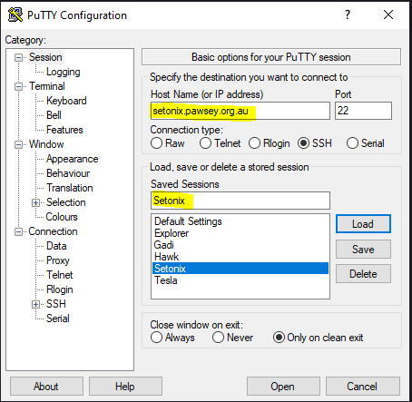
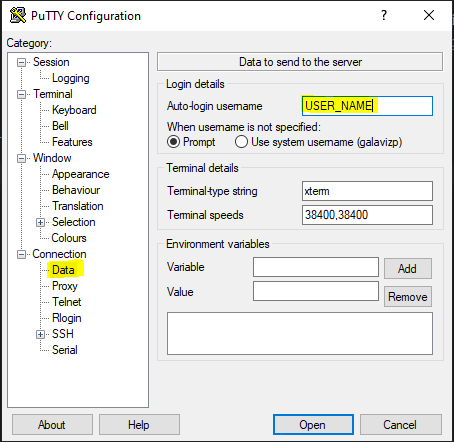
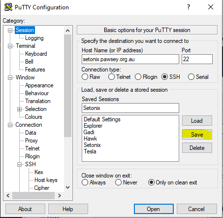

# Access to Setonix HPC. 

In this section, we will briefly overview Setonix and configure access to the HPC.
See Setonix's full [documentation](https://pawsey.atlassian.net/wiki/spaces/US/pages/51930840/Supercomputing+Documentation) for more details. 

If you have access to an HPC or server with Quantum Espresso installed, you can skip to Step 2.  

# Login instructions.

**Note: The following instructions should be done before the start of the practicals!**

We will use Secure Shell (ssh) to connect. First, we need to install a ssh client. 
For Windows computers we can use [PuTTY](https://putty.org/) or via [WSL](https://learn.microsoft.com/en-us/windows/wsl/install). 
For macOS and GNU/LINUX, we can use the `ssh` command from the Terminal.  

## Configure PuTTY.
* Add `setonix.pawsey.org.au` to *Sessions --> Host Name*. Add Setonix to *Saved Sessions*. 



* Add your Pawsey username (provided) under *Connection --> Data --> Auto-login username*.



* Return to *Sessions* nd click save. 



* Click Open to start an ssh connection. Use your Pawsey password to login. 

## Configure ssh with WSL, macOS or GNU/Linux. 

To install the client in Ubuntu/Debian based distributions:
```shell
sudo apt install openssh-client
```
For RedHat based distributions:
```shell
sudo dnf install openssh-clients
```
Or 
```shell
sudo yum install openssh-clients
```
You can connect to Setonix using the command:
```shell
ssh USER_NAME@setonix.pawsey.org.au
```
You need your Pawsey USER_NAME and password. 

### Optional configuration. 

From a terminal create a `config` file under the `~/.ssh` directory:
```shell
cd
mkdir .ssh # ignore the warning if the directory exists
nano .ssh/config
```

Add the following lines to the `config` file with your username. 
```
Host Setonix
     Hostname setonix.pawsey.org.au
     User <PAWSEY_USERNAME>
     Port 22
```

Save the file (Ctrl+O) and exit (Ctrl+X). Login to setonix using the following command:
```shell
ssh Setonix
```

# Basic terminal commands 

We will primarily use a command line terminal. Pawsey supercomputers run Linux-based operating systems with a bash terminal. For more details, follow the [shell](https://swcarpentry.github.io/shell-novice/index.html) guide. 

Print the Working Directory using:
```shell
pwd  
```

LiSt the files on the current directory or subdirectory with:
```shell
ls 
ls /path/to/other/directory
```

The Change Directory command is:
```shell
cd /path/to/other/directory
```

# How to copy files
