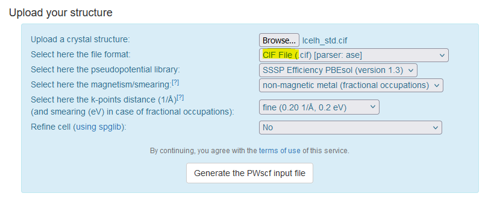

# Introduction 

## Quantum ESPRESSO

Quantum ESPRESSO (QE) is a suite of Open-Source software for electronic-structure calculations and materials modeling.  It is based on density-functional theory, plane waves, and pseudopotentials.

Lattice Dynamics (LD) simulations are used to study the vibrations of atoms in a crystal lattice. These simulations can provide information about the phonon dispersion curves of a material, which is vital for understanding thermal and mechanical properties.

## Phonon calculation workflow

### Crystal structure

For this practical session we will calculate the phonon density of states of Ice Ih. The directory `structure` contains a cif file for Ice Ih.


The calculation consist of the following:
1. Input parameter optimization
2. Structure relaxation
3. Self-consistent field calculation
4. Phonon calculation using Density-Functional Perturbation Theory (DFPT)
5. Visualization, Analysis and experimental validation. 

Steps 3 to 7 of this tutorial describe the procedure. 

### Input parameters

QE requires an input parameter file and pseudo potential files for the structure. 
A convenient way to generate QE input is provided by the following online tool [https://www.materialscloud.org/work/tools/qeinputgenerator](https://www.materialscloud.org/work/tools/qeinputgenerator)
Select the `CIF File` format and upload the `IceIh_std.cif` file. Then click `Generate the PWscf input file` button. 



Download the zip file. It contains an input file and pseudopotentials. 


Copy the zip file to Setonix (see [how to copy files](../Step1/README.md)).

The `template` directory contains the unzipped files. We renamed the parameter file `pw.in`. The original name `pwscf.in` indicates that it is an input file for QE's plan wave `pw.x` command that performs self-consistent field (scf) calculation.
We will modify the file to perform several tasks. The directory `pseudo` contains the files for the `H` and `O` pseudo potentials required by the plane wave calculation method. 
The full description of each parameter is given in the QE [online documentation](https://www.quantum-espresso.org/Doc/INPUT_PW.html). 

For now, we will only change the `prefix` of the calculation:


### Running a calculation in Setonix

The `template` folder contains a [Slurm Batch Script for Setonix](https://pawsey.atlassian.net/wiki/spaces/US/pages/51927426/Example+Slurm+Batch+Scripts+for+Setonix+on+CPU+Compute+Nodes). 
First we will make a copy of the `template` directory to run a single SCF calculation test.
```shell
cp -r template test
```
Before submitting a job for execution we need to modify the script using a text editor `nano template/submit_jobs.sh`. Add the correct project number.
```shell
#SBATCH --account=pawseyXXXX
```
And also your email address.
```shell
#SBATCH --mail-user=user@email.com
```
To submitting the job we use the following command
```shell
sbatch setonix_job.sh
```
To monitor the state of the job we use the following command
```shell
squeue --me
```
