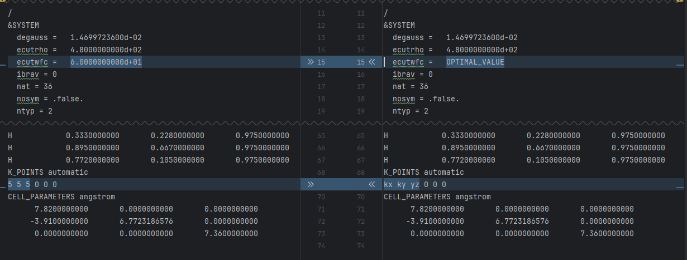

# Input parameter optimization

First, we will optimize the energy cut-off and, later, the number of k-points.

## Energy cut-off
The `energy_cutoff` directory contains a template and two bash scripts.
The `submit_jobs.sh` script creates and submits a set of runs using the template and modifies the energy cut-off parameter `ecutwfc`.  

To run the scripts, first edit the script `nano template/submit_jobs.sh` using the correct project parameter and email. 
Make the script executable and run it.
```shell
chmod +x submit_jobs.sh
./submit_jobs.sh
```
Check the job status with `squeue --me`. Once all the jobs are completed, run the following command to perform the analysis.
```shell
chmod +x analysis.sh
./analysis.sh
```
The result is stored in `data.csv`. It should look like (use `cat data.csv` to see the content of the file)

| ecutwfc | total_energy   | time   |
|---------|----------------|--------|
| 30      | -520.77936283  | 124.29 |
| 40      | -521.60793274  | 176.14 |
| 50      | -521.65820463  | 260.91 |
| 60      | -521.66852127  | 353.09 |
| 70      | -521.67879795  | 469.49 |

The energy should converge for a large enough `ecutwfc`; the optimal energy cut-off is close to the convergent value and minimizes the execution time. 
We will select 50 Ry (680.2 eV).

## K-points

We will follow a similar k-point optimization procedure and perform the convergence test inside the `kpoints` directory. 
After selecting the right energy cut-off value, we should update the input parameters in our template using the command `nano template/pw.in`. 



The second difference in `pw.in` is a label we will use to locate and replace the values of the number of k-points.
The `submit_jobs.sh` script replaces that label with the values we want to test. Similar to the energy cut-off, we will run a set of SCF calculations and test convergence in total energy.

To run the scripts, first edit the script `nano template/submit_jobs.sh` using the correct project parameter and email. 
Make the script executable and run it.
```shell
chmod +x submit_jobs.sh
./submit_jobs.sh
```
Check the job status with `squeue --me`. Once all the jobs are finished, run the following command to perform the analysis.
```shell
chmod +x analysis.sh
./analysis.sh
```
The result is stored in `data.csv`. It should look like (use `cat data.csv` to see the content of the file)

| kxy | kz | total_energy  | time   |
|-----|----|---------------|--------|
| 1   | 1  | -521.64745684 | 43.44  |
| 1   | 2  | -521.65402025 | 58.62  |
| 1   | 5  | -521.65395331 | 63.47  |
| 1   | 6  | -521.65399238 | 86.16  |
| 1   | 8  | -521.65398710 | 102.39 |
| 2   | 1  | -521.65189766 | 57.44  |
| 2   | 2  | -521.65819571 | 78.10  |
| 2   | 5  | -521.65820311 | 130.35 |
| 2   | 6  | -521.65820127 | 146.11 |
| 2   | 8  | -521.65821018 | 183.94 |
| 5   | 1  | -521.65190639 | 93.70  |
| 5   | 2  | -521.65820072 | 161.60 |
| 5   | 5  | -521.65820463 | 236.01 |
| 5   | 6  | -521.65820424 | 320.44 |
| 5   | 8  | -521.65820801 | 406.77 |
| 6   | 1  | -521.65189954 | 131.48 |
| 6   | 2  | -521.65820570 | 247.17 |
| 6   | 5  | -521.65820965 | 353.37 |
| 6   | 6  | -521.65820830 | 462.48 |
| 6   | 8  | -521.65821156 | 571.73 |
| 8   | 1  | -521.65190214 | 162.50 |
| 8   | 2  | -521.65820492 | 304.90 |
| 8   | 5  | -521.65821090 | 497.23 |
| 8   | 6  | -521.65820687 | 657.01 |
| 8   | 8  | -521.65821080 | 812.65 |

Once again, we want to select a value close to convergence and minimize the calculation time.
We can reformat the table to identify the optimal value quickly. 

### Total Energy (Ry)
| kz\kxy | 1            |   2            | 5             | 6             | 8             |
|--------|--------------|---------------|---------------|---------------|---------------|
| 1      | -521.6474568 |   -521.6518977 |     -521.6519064 |     -521.6518995 |     -521.6519021 |
| 2      | -521.6540203 |   -521.6581957 |     -521.6582007 |     -521.6582057 |     -521.6582049 |
| 5      | -521.6539533 |   -521.6582031 |     -521.6582046 |     -521.6582097 |     -521.6582109 |
| 6      | -521.6539924 |   -521.6582013 |     -521.6582042 |     -521.6582083 |     -521.6582069 |
| 8      | -521.6539871 |   -521.6582102 |     -521.658208  |     -521.6582116 |     -521.6582108 |

### Time (sec)
| kz\kxy | 1      | 2      | 5      | 6       | 8      |
|--------|--------|--------|--------|---------|--------|
| 1      | 43.44  | 57.44  | 93.7   | 131.48  | 162.5  |
| 2      | 58.62  | 78.1   | 161.6  | 247.17  | 304.9  |
| 5      | 63.47  | 130.35 | 236.01 | 353.37  | 497.23 |
| 6      | 86.16  | 146.11 | 320.44 | 462.48  | 657.01 |
| 8      | 102.39 | 183.94 | 406.77 |   571.73 | 812.65 |

We will select a 2x2x2 k-point mesh. 