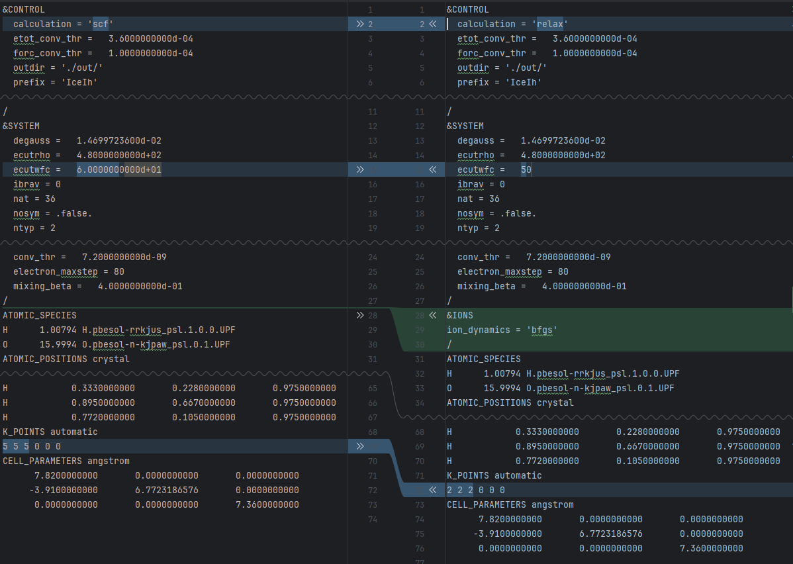
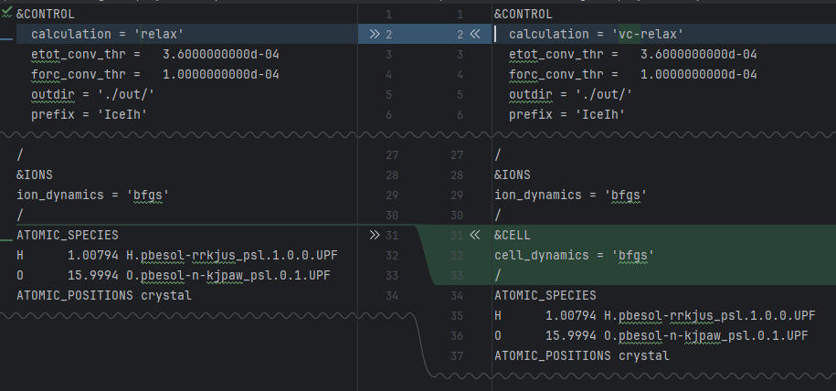

# Structure relaxation

The structure relaxation is the first step in the phonon calculation. We need to relax the crystal structure to minimize the forces between atoms.
We will use the relaxed structure to calculate the phonons. Effectively, we will obtain the phonon vibrations at 0 K temperature.

## Ions position relaxation. 
First, we will relax the ions' positions. We need to change a couple of parameters in our input parameters file.



We will make a copy of the template to run the simulation. 
```shell
cp -r template run1 
cd run1
nano setonix_job.sh
```
Update `setonix_job.sh` with the right project and email values. 
```shell
sbatch setonix_job.sh
```
Once the job runs, we can monitor its progress by looking at the total force from the output file.
```shell
grep "Total force =" pw.out
```
The result is a decreasing list of values
>     Total force =     2.423660     Total SCF correction =     0.000106
>     Total force =     0.683344     Total SCF correction =     0.000065
>     Total force =     0.552086     Total SCF correction =     0.000211
>     Total force =     0.288968     Total SCF correction =     0.000141
>     Total force =     0.565633     Total SCF correction =     0.000049
The tolerance is given by `forc_conv_thr` value in the input file. In our case, `forc_conv_thr=1.0000000000d-04`.
Once the job finishes, we can check the status by looking at the end of the output file.
```shell
tail pw.out
```
If the job finishes properly, it should show 
>   JOB DONE.

## Extracting the ions' positions

We need to update our template with the relaxed position. The output file `pw.out` has the position at the end of the file. 
Search for the following section:

```
Begin final coordinates

ATOMIC_POSITIONS (crystal)
O             0.3307775014        0.3307775014        0.5558618715
O             0.6692224986        0.0000000000        0.5558618715
O             0.0000000000        0.6692224986        0.5558618715
O             0.6692224986        0.6692224986        0.0558618715
O             0.3307775014       -0.0000000000        0.0558618715
O             0.0000000000        0.3307775014        0.0558618715
O             0.6637735972        0.6637735972        0.4311192124
O             0.3362264028       -0.0000000000        0.4311192124
O            -0.0000000000        0.3362264028        0.4311192124
O             0.3362264028        0.3362264028        0.9311192124
O             0.6637735972       -0.0000000000        0.9311192124
O             0.0000000000        0.6637735972        0.9311192124
H             0.3342840733        0.3342840733        0.6924169883
H             0.6657159267        0.0000000000        0.6924169883
H             0.0000000000        0.6657159267        0.6924169883
H             0.6657159267        0.6657159267        0.1924169883
H             0.3342840733       -0.0000000000        0.1924169883
H             0.0000000000        0.3342840733        0.1924169883
H             0.4532992809        0.4532992809        0.5142728751
H             0.5467007191       -0.0000000000        0.5142728751
H             0.0000000000        0.5467007191        0.5142728751
H             0.5467007191        0.5467007191        0.0142728751
H             0.4532992809       -0.0000000000        0.0142728751
H            -0.0000000000        0.4532992809        0.0142728751
H             0.7862460160        0.6673737118        0.4781645264
H             0.3326262882        0.1188723041        0.4781645264
H             0.8811276959        0.2137539840        0.4781645264
H             0.6673737118        0.7862460160        0.4781645264
H             0.1188723041        0.3326262882        0.4781645264
H             0.2137539840        0.8811276959        0.4781645264
H             0.2137539840        0.3326262882        0.9781645264
H             0.6673737118        0.8811276959        0.9781645264
H             0.1188723041        0.7862460160        0.9781645264
H             0.3326262882        0.2137539840        0.9781645264
H             0.8811276959        0.6673737118        0.9781645264
H             0.7862460160        0.1188723041        0.9781645264
End final coordinates
```
## Lattice relaxation

In some cases, we will also need to relax the lattice parameters. The procedure is similar, but we will need to make some changes to the input parameters.
We must change the calculation parameter to `vc-relax` and add a `CELL` section. The following figure shows the corresponding changes to the file.

