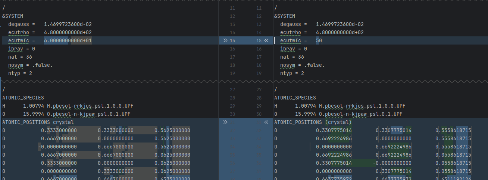
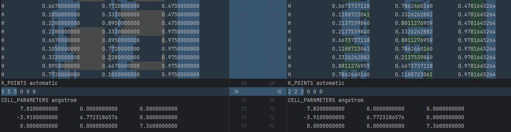
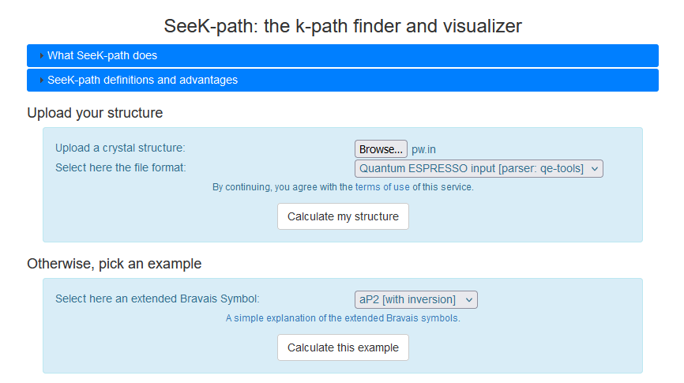
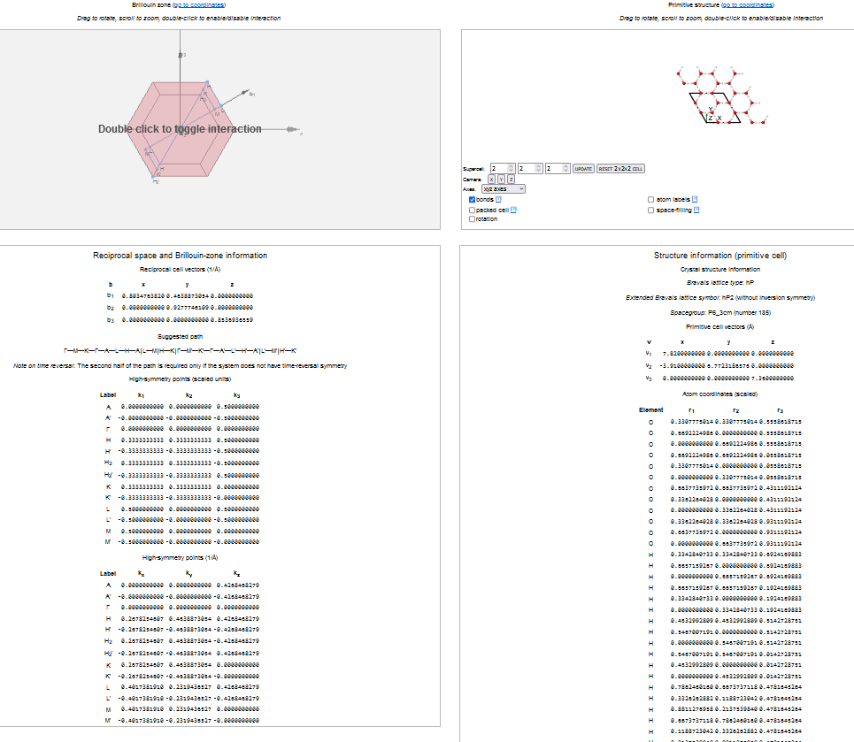

# Phonon calculation 

We will perform the phonon calculation in five steps. We need one parameter file for each step: `pw.in, ph.in, q2r.in, matdyn.dos.in and matdyn.in`.  
Energy cut-off, k-points and ions' positions are the changes from the initial `pw.in` parameter files. 



The Setonix script job runs the five commands in sequence:
```
# -----Executing command:
srun -u -N "$SLURM_JOB_NUM_NODES" -n "$SLURM_NTASKS" -c "$OMP_NUM_THREADS" -m block:block:block pw.x -in pw.in > pw.out
srun -u -N "$SLURM_JOB_NUM_NODES" -n "$SLURM_NTASKS" -c "$OMP_NUM_THREADS" -m block:block:block ph.x -in ph.in > ph.out
srun -u -N "$SLURM_JOB_NUM_NODES" -n "$SLURM_NTASKS" -c "$OMP_NUM_THREADS" -m block:block:block q2r.x -in q2r.in > q2r.out
srun -u -N "$SLURM_JOB_NUM_NODES" -n "$SLURM_NTASKS" -c "$OMP_NUM_THREADS" -m block:block:block matdyn.x -in matdyn.dos.in > matdyn.dos.out
srun -u -N "$SLURM_JOB_NUM_NODES" -n "$SLURM_NTASKS" -c "$OMP_NUM_THREADS" -m block:block:block matdyn.x -in matdyn.in > matdyn.out
#=====END====
```
The first command, `pw.x`, runs a self-consistent field calculation. The second command, `ph.x`, performs the phonon calculation using Density-Functional Perturbation Theory (DFPT). The third command, `q2r.x`, reads force constant matrices *C(q)* produced by the `ph.x` code
for a grid of q-points and calculates the corresponding set of interatomic force constants. Finally, `matdyn.x` calculates the phonon frequencies for a list of generic *q* vectors.

The detailed documentation for each command is in the following [link](https://www.quantum-espresso.org/documentation/input-data-description/). 

The `ph.in` file has the following parameters:
```text
Phonon dispersion
 &INPUTPH
  prefix='IceIh',
  tr2_ph = 1.0d-14,
  amass(1) = 1.00794,
  amass(2) = 15.9994
  ldisp = .true.,
  nq1 = 4,
  nq2 = 4,
  nq3 = 4,
  outdir='./out'
  fildyn='IceIh.dyn',
 /
```
**Note: the `prefix` and `out` parameters should be the same for `pw.in` and `ph.in` input files.**
The `q2r.in` file has the following parameters:
```text
&input
   fildyn='IceIh.dyn',
   zasr='simple',
   flfrc='IceIh.fc'
 /
```
**Note: the `fildyn` parameter should be the same for `ph.in` and `q2r.in` input files.**
The `matdyn.x` command has two input files: one to compute the phonon density of states and the other to compute the band dispersion.
The `matdyn.dos.in` file has the following parameters:
```text
&INPUT
 asr='simple'
 amass(1) = 1.00794
 amass(2) = 15.9994
 flfrc='IceIh.fc'
 dos = .true
 nk1 = 4
 nk2 = 4
 nk3 = 4
 deltaE = 1
 degauss = 8.065610
 flfrq = 'IceIh.dos.freq'
 flvec = 'IceIh.dos.modes'
 fleig = 'IceIh.dos.eig'
 fldyn = 'IceIh.dos.dynmat'
/
```
The `matdyn.in` file has the following parameters:
```text
&input
asr='simple'
amass(1) = 1.00794
amass(2) = 15.9994
flfrc='IceIh.fc'
flfrq='IceIh.freq'
/
          24
        0.0000000000    0.0000000000    0.0000000000    1.0
        0.0000000000    0.0000000000    0.1666666667    1.0
        0.0000000000    0.0000000000    0.3333333333    1.0
        0.0000000000    0.0000000000    0.5000000000    1.0
        0.0666660000    0.0666660000    0.4000000000    1.0
        0.1333320000    0.1333320000    0.3000000000    1.0
        0.1999980000    0.1999980000    0.2000000000    1.0
        0.2666640000    0.2666640000    0.1000000000    1.0
        0.3333300000    0.3333300000    0.0000000000    1.0
        0.3333300000    0.3333300000    0.1666666667    1.0
        0.3333300000    0.3333300000    0.3333333333    1.0
        0.3333300000    0.3333300000    0.5000000000    1.0
        0.3749975000    0.2499975000    0.3750000000    1.0
        0.4166650000    0.1666650000    0.2500000000    1.0
        0.4583325000    0.0833325000    0.1250000000    1.0
        0.5000000000    0.0000000000    0.0000000000    1.0
        0.5000000000    0.0000000000    0.1666666667    1.0
        0.5000000000    0.0000000000    0.3333333333    1.0
        0.5000000000    0.0000000000    0.5000000000    1.0
        0.4000000000    0.0000000000    0.4000000000    1.0
        0.3000000000    0.0000000000    0.3000000000    1.0
        0.2000000000    0.0000000000    0.2000000000    1.0
        0.1000000000    0.0000000000    0.1000000000    1.0
        0.0000000000    0.0000000000    0.0000000000    1.0
```
This file includes paths in reciprocal space that generates the band structure. We can find suggested path using the [seekpath](https://www.materialscloud.org/work/tools/seekpath) online tool.
We can use the `pw.in` file to generate the suggested paths. 


The tool gives us a visualization of the reciprocal space and the coordinates of the paths. 




```
Γ 	0.0000000000 	0.0000000000 	0.0000000000
A 	0.0000000000 	0.0000000000 	0.5000000000
K 	0.3333333333 	0.3333333333 	0.0000000000
H 	0.3333333333 	0.3333333333 	0.5000000000
M 	0.5000000000 	0.0000000000 	0.0000000000
L 	0.5000000000 	0.0000000000 	0.5000000000
Γ 	0.0000000000 	0.0000000000 	0.0000000000
```

0.0000000000 	0.0000000000 	0.0000000000
0.0000000000 	0.0000000000 	0.5000000000
0.3333333333 	0.3333333333 	0.0000000000
0.3333333333 	0.3333333333 	0.5000000000
0.5000000000 	0.0000000000 	0.0000000000
0.5000000000 	0.0000000000 	0.5000000000
0.0000000000 	0.0000000000 	0.0000000000
