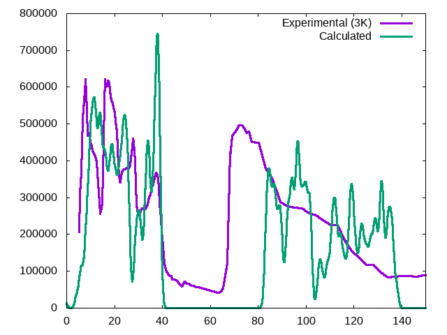
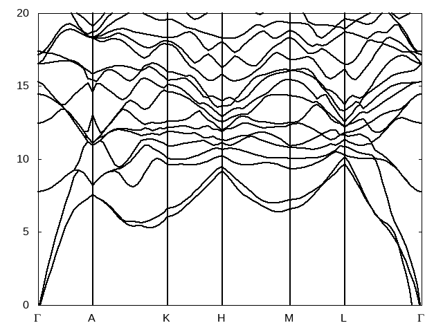
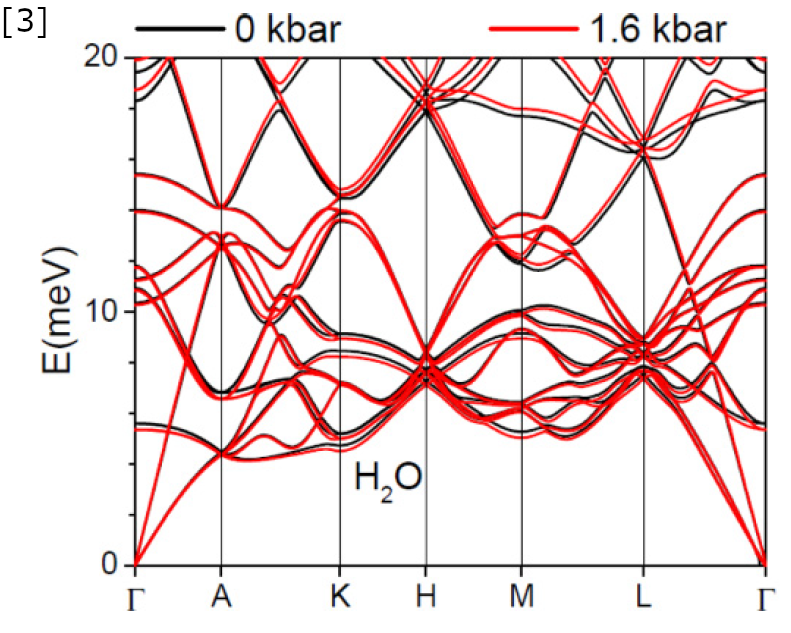
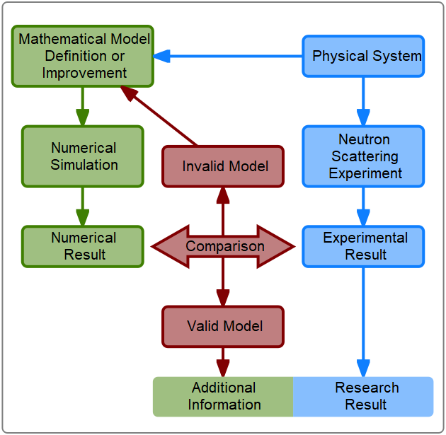

# Data Analysis

 We will analyze the result using experimental data and a reference calculation. 
 
# Density of States

We will use *gnuplot* to generate the density of states plot. We will use the script `plot_dos.gnuplot` from Setonix terminal. 
```shell
 module load gnuplot/5.4.3
 gnuplot plot_dos.gnuplot
```
The script creates `figures/dos_comparison.png` that compares the calculated and experimental results.  
Alternatively we can comment the first two lines and add `pause -1` to show the plot.



The result correlates relatively well with the experiment for energies below 40 meV. 
However, the calculated result has a larger band gap between 40 and 80 meV instead of 40 and 65 meV.

# Phonon dispersion 

We can generate the phonon dispersion plot with:
```shell
gnuplot plot_band.gnuplot
```
The script produces the following result: 


We can compare this with a literature reference "Phonons and anomalous thermal expansion behavior of H2O and D2O ice Ih".
[DOI:10.1103/PhysRevB.98.104301](https://doi.org/10.1103/PhysRevB.98.104301)



We can use the [interactive phonon visualizer](https://interactivephonon.materialscloud.io/) online tool 

## Improving the result 



The result shows that we need to improve our model. The way to improve the model depends on the system. 
In this case, we can use different pseudopotentials. There are several options, including using the precision SSSP [pseudopotentials](https://www.materialscloud.org/discover/sssp/table/precision).
We can modify some on the input parameters. For Ice Ih we can include Van der Waals corrections. In QE we can include VdW corrections using the `vdw_corr` parameter. 

